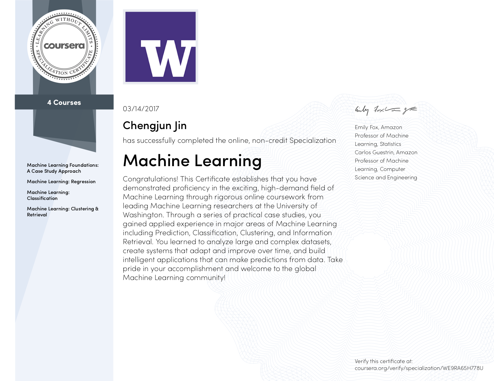

# Machine learning Specialization

This Specialization from leading researchers at the University of Washington introduces you to the exciting, high-demand field of Machine Learning. Through a series of practical case studies, you will gain applied experience in major areas of Machine Learning including Prediction, Classification, Clustering, and Information Retrieval. You will learn to analyze large and complex datasets, create systems that adapt and improve over time, and build intelligent applications that can make predictions from data.

Learners will implement and apply predictive, classification, clustering, and information retrieval machine learning algorithms to real datasets throughout each course in the specialization. They will walk away with applied machine learning and Python programming experience.

**Four courses are included:**
* Course 1: Machine Learning Foundations: A Case Study Approach
* Course 2: Machine Learning: Regression
* Course 3: Machine Learning: Classification
* Course 4: Machine Learning: Clustering and Retrieval

**Programming tools:** 
Python, Scikit-learn, Numpy, Matplotlib, Pandas, GraphLab Create (similiar to Scikit-learn), SFrame (similiar to Pandas).

**Verified certificate:** [Check the online version here](https://www.coursera.org/account/accomplishments/specialization/certificate/WE9RA65H778U)

-------------------------------------------
## About Course 1: Machine Learning Foundations: A Case Study Approach

* 6 weeks of study, 5-8 hours/week

Do you have data and wonder what it can tell you?  Do you need a deeper understanding of the core ways in which machine learning can improve your business? Do you want to be able to converse with specialists about anything from regression and classification to deep learning and recommender systems?

In this course, you will get hands-on experience with machine learning from a series of practical case-studies.  At the end of the first course you will have studied how to predict house prices based on house-level features, analyze sentiment from user reviews, retrieve documents of interest, recommend products, and search for images.  Through hands-on practice with these use cases, you will be able to apply machine learning methods in a wide range of domains.

This first course treats the machine learning method as a black box.  Using this abstraction, you will focus on understanding tasks of interest, matching these tasks to machine learning tools, and assessing the quality of the output. In subsequent courses, you will delve into the components of this black box by examining models and algorithms.  Together, these pieces form the machine learning pipeline, which you will use in developing intelligent applications.

**Learning Outcomes:**
* Identify potential applications of machine learning in practice.  
* Describe the core differences in analyses enabled by regression, classification, and clustering.
* Select the appropriate machine learning task for a potential application.  
* Apply regression, classification, clustering, retrieval, recommender systems, and deep learning.
* Represent your data as features to serve as input to machine learning models. 
* Assess the model quality in terms of relevant error metrics for each task.
* Utilize a dataset to fit a model to analyze new data.
* Build an end-to-end application that uses machine learning at its core.  
* Implement these techniques in Python.

**Programming assignments:**
* Week 2: Predicting House Prices [[ipynb](Course_1/Week_2_Predicting_house_prices.ipynb)]
* Week 3: Analyzing Product Sentiment [[ipynb](Course_1/Week_3_Analyzing_product_sentiment.ipynb)]
* Week 4: Retrieving Wikipedia articles [[ipynb](Course_1/Week_4_Retrieving_Wikipedia_articles.ipynb)]
* Week 5: Song recommender [[ipynb](Course_1/Week_5_Song_recommender.ipynb)]
* Week 6: Deep features for image retrieval [[ipynb](Course_1/Week_6_Deep_features_for_image_retrieval.ipynb)]

---------------------------------------------
## About Course 2: Machine Learning: Regression

* 6 weeks of study, 5-8 hours/week

In our first case study, predicting house prices, you will create models that predict a continuous value (price) from input features (square footage, number of bedrooms and bathrooms,...).  This is just one of the many places where regression can be applied.  Other applications range from predicting health outcomes in medicine, stock prices in finance, and power usage in high-performance computing, to analyzing which regulators are important for gene expression.

In this course, you will explore regularized linear regression models for the task of prediction and feature selection.  You will be able to handle very large sets of features and select between models of various complexity.  You will also analyze the impact of aspects of your data -- such as outliers -- on your selected models and predictions.  To fit these models, you will implement optimization algorithms that scale to large datasets.

**Learning Outcomes:**
* Describe the input and output of a regression model.
* Compare and contrast bias and variance when modeling data.
* Estimate model parameters using optimization algorithms.
* Tune parameters with cross validation.
* Analyze the performance of the model.
* Describe the notion of sparsity and how LASSO leads to sparse solutions.
* Deploy methods to select between models.
* Exploit the model to form predictions. 
* Build a regression model to predict prices using a housing dataset.
* Implement these techniques in Python.

**Programming assignments:**
* Week 1: Simple linear regression [[ipynb](Course_2/Week_1_Simple_linear_regression.ipynb)] 
* Week 2: Multiple regression [[ipynb_1](Course_2/Week_2_1_Multiple_regression.ipynb)], [[ipynb_2](Course_2/Week_2_2_Multiple_regression.ipynb)]
* Week 3: Assessing fit [[ipynb](Course_2/Week_3_Assessing_fit.ipynb)]
* Week 4: Ridge regression [[ipynb_1](Course_2/Week_4_1_Ridge_regression.ipynb)], [[ipynb_2](Course_2/Week_4_2_Ridge_regression.ipynb)]
* Week 5: LASSO [[ipynb_1](Course_2/Week_5_1_Feature_selection_and_LASSO.ipynb)], [[ipynb_2](Course_2/Week_5_2_LASSO.ipynb)]
* Week 6: Local regression [[ipynb](Course_2/Week_6_Local_regression.ipynb)]

--------------------------------------------------

## About Course 3: Machine Learning: Classification
* 7 weeks of study, 5-8 hours/week

In our case study on analyzing sentiment, you will create models that predict a class (positive/negative sentiment) from input features (text of the reviews, user profile information,...).  In our second case study for this course, loan default prediction, you will tackle financial data, and predict when a loan is likely to be risky or safe for the bank. These tasks are an examples of classification, one of the most widely used areas of machine learning, with a broad array of applications, including ad targeting, spam detection, medical diagnosis and image classification. 

In this course, you will create classifiers that provide state-of-the-art performance on a variety of tasks.  You will become familiar with  the most successful techniques, which are most widely used in practice, including logistic regression, decision trees and boosting.  In addition, you will be able to design and implement the underlying algorithms that can learn these models at scale, using stochastic gradient ascent.  You will implement these technique on real-world, large-scale machine learning tasks.  You will also address significant tasks you will face in real-world applications of ML, including handling missing data and measuring precision and recall to evaluate a classifier.  This course is hands-on, action-packed, and full of visualizations and illustrations of how these techniques will behave on real data.  We've also included optional content in every module, covering advanced topics for those who want to go even deeper! 

**Learning Objectives:**
* Describe the input and output of a classification model.
* Tackle both binary and multiclass classification problems.
* Implement a logistic regression model for large-scale classification.  
* Create a non-linear model using decision trees.
* Improve the performance of any model using boosting.
* Scale your methods with stochastic gradient ascent.
* Describe the underlying decision boundaries.  
* Build a classification model to predict sentiment in a product review dataset.  
* Analyze financial data to predict loan defaults.
* Use techniques for handling missing data.
* Evaluate your models using precision-recall metrics.
* Implement these techniques in Python.

**Programming assignments:**
* Week 1: Predicting sentiment from product reviews [[ipynb](Course_3/Week_1_Predicting_sentiment_from_product_reviews.ipynb)]
* Week 2: Implementing logistic regression from scratch [[ipynb](Course_3/Week_2_1_Implementing_logistic_regression_from_scratch.ipynb)], L2_regularization [[ipynb](Course_3/Week_2_2_Logistic_regression_with_L2_regularization.ipynb)]
* Week 3: Identifying safe loans with decision trees [[ipynb](Course_3/Week_3_1_Identifying_safe_loans_with_decision_trees.ipynb)], Implementing binary decision tree [[ipynb](Course_3/Week_3_2_Implementing_binary_decision_trees.ipynb)]
* Week 4: Decision trees in practice [[ipynb](Course_3/Week_4_Decision_trees_in_practice.ipynb)]
* Week 5: Exploring ensemble methods [[ipynb](Course_3/Week_5_1_Exploring_ensemble_methods.ipynb)], Boosting a decision stump [[ipynb](Course_3/Week_5_2_Boosting_a_decision_stump.ipynb)]
* Week 6: Exploring precision and recall [[ipynb](Course_3/Week_6_Exploring_precision_and_recall.ipynb)]
* Week 7: Online learning [[ipynb](Course_3/Week_7_Online_learning.ipynb)]

----------------------------------------------
## About Course 4: Machine Learning: Clustering and Retrieval
* 6 weeks of study, 5-8 hours/week

A reader is interested in a specific news article and you want to find similar articles to recommend.  What is the right notion of similarity?  Moreover, what if there are millions of other documents?  Each time you want to a retrieve a new document, do you need to search through all other documents?  How do you group similar documents together?  How do you discover new, emerging topics that the documents cover?   

In this third case study, finding similar documents, you will examine similarity-based algorithms for retrieval.  In this course, you will also examine structured representations for describing the documents in the corpus, including clustering and mixed membership models, such as latent Dirichlet allocation (LDA).  You will implement expectation maximization (EM) to learn the document clusterings, and see how to scale the methods using MapReduce.

**Learning Outcomes:**
* Create a document retrieval system using k-nearest neighbors.
* Identify various similarity metrics for text data.
* Reduce computations in k-nearest neighbor search by using KD-trees.
* Produce approximate nearest neighbors using locality sensitive hashing.
* Compare and contrast supervised and unsupervised learning tasks.
* Cluster documents by topic using k-means.
* Describe how to parallelize k-means using MapReduce.
* Examine probabilistic clustering approaches using mixtures models.
* Fit a mixture of Gaussian model using expectation maximization (EM).
* Perform mixed membership modeling using latent Dirichlet allocation (LDA).
* Describe the steps of a Gibbs sampler and how to use its output to draw inferences.
* Compare and contrast initialization techniques for non-convex optimization objectives.
* Implement these techniques in Python.

**Programming assignments:**
* Week 2: Features and metrics for nearest neighbor searching [[ipynb](Course_4/Week_2_1_Features_and_metrics_for_nearest_neighbor.ipynb)], Implementing locality_sensitive hashing from scratch [[ipynb](Course_4/Week_2_2_Implementing_locality_sensitive_hashing_from_scratch.ipynb)]
* Week 3: Clustering text data with k-means [[ipynb](Course_4/Week_3_Clustering_text_data_with_k-means.ipynb)]
* Week 4: Implementing EM for Gaussian mixtures [[ipynb](Course_4/Week_4_1_Implementing_EM_for_Gaussian_mixtures.ipynb)], Clustering text data with Gaussian mixtures [[ipynb](Course_4/Week_4_2_Clustering_text_data_with_Gaussian_mixtures.ipynb)]
* Week 5: Latent dirichlet allocation for text data [[ipynb](Course_4/Week_5_Latent_dirichlet_allocation_for_text_data.ipynb)]
* Week 6: Hierarchical clustering [[ipynb](Week_6_Hierarchical_clustering.ipynb)]